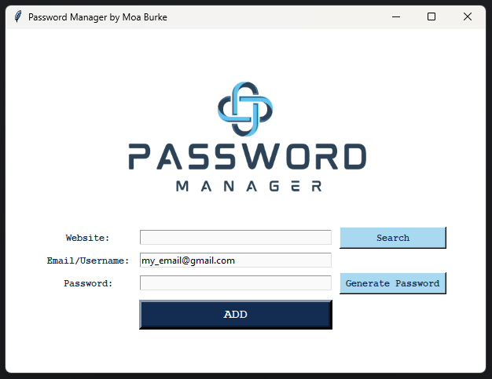

# Password Manager Application


A simple password manager that allows users to:
1. Generate random passwords using letters, numbers, and symbols.
2. Save website, email/username, and password details into a JSON file.
3. Copy passwords to the clipboard for easy pasting.
4. Validate user input and provide error messages for incomplete entries.
5. Search for saved passwords by website name.

## Features
- Includes functionality to generate, save, and manage multiple passwords.
- Generates strong, random passwords.
- Saves password data securely in a JSON file for structured and easy-to-read formatting.
- Provides a search function to quickly retrieve saved website credentials.
- Ensures error handling for file-related issues, like missing data files.
- Website names are saved in title case for consistency.
- Utilizes Tkinter for the user interface with a clean and responsive design.

## Installation
To run this project, ensure you have Python installed on your computer. You can download Python from [python.org](https://www.python.org/).
- **Note**: Tkinter is included with most Python installations. No additional installation is required for Tkinter.
  
1. **Clone the Repository**:
```bash
git clone https://github.com/moaburke/PasswordManager.git
```
2. **Navigate to the project directory**:
```bash
cd PasswordManager
```
4. **Install required packages** (if applicable):
```bash
pip install pyperclip
```

## Usage

1. **Run the Application**:
   - Execute the Python script to launch the Password Manager interface. Make sure you have Tkinter and any required libraries installed.

2. **Enter Website Information**:
   - In the **Website** field, input the name of the website for which you want to save the password.

3. **Email/Username Entry**:
   - Fill in the **Email/Username** field with your email address or username associated with the website. A default email is pre-filled for convenience, which you can modify. You can also set your own email as the default email by changing the value in the code.

4. **Enter or Generate a Password**:
   - You can either enter your own password or click the **"Generate Password"** button to create a random password. The generated password will automatically appear in the **Password** field.

5. **Save the Password Details**:
   - Click the **"ADD"** button to save your website, email, and password information. If any fields are empty, an error message will prompt you to fill them out.

6. **Copy Password to Clipboard**:
   - After generating a password, it is automatically copied to your clipboard for easy pasting into other applications.

7. **Search Saved Data:**:
- Use the **"Search"** button to retrieve saved credentials for a specific website. If the website exists, its email and password will be displayed, and the password will be copied to your clipboard.

## Updates

- **Version 1.1** (17 Oct 2024):
  - Switched from saving data in a `.txt` file to a `JSON` file for better structure and management.
  - Added error handling using `try-except` blocks to manage file-related issues.
  - Enforced title case for website names to ensure consistency when saving and searching.
  - Added a search feature to retrieve saved passwords for specific websites.

**Files**:
- Saves password data in `data.json` for structured storage.
- Uses `logo.png` as the application logo.
